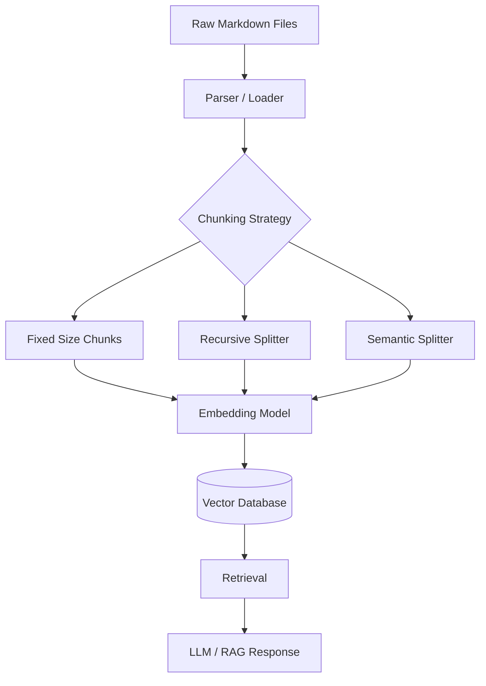
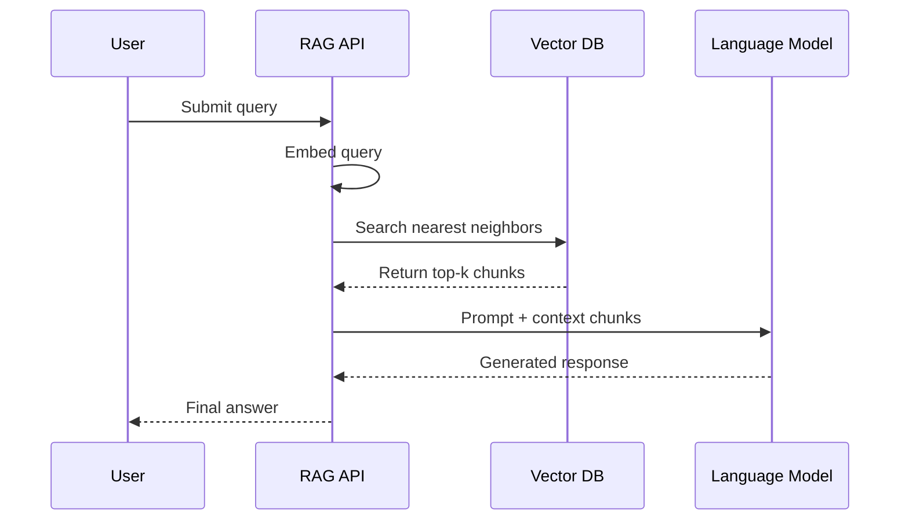
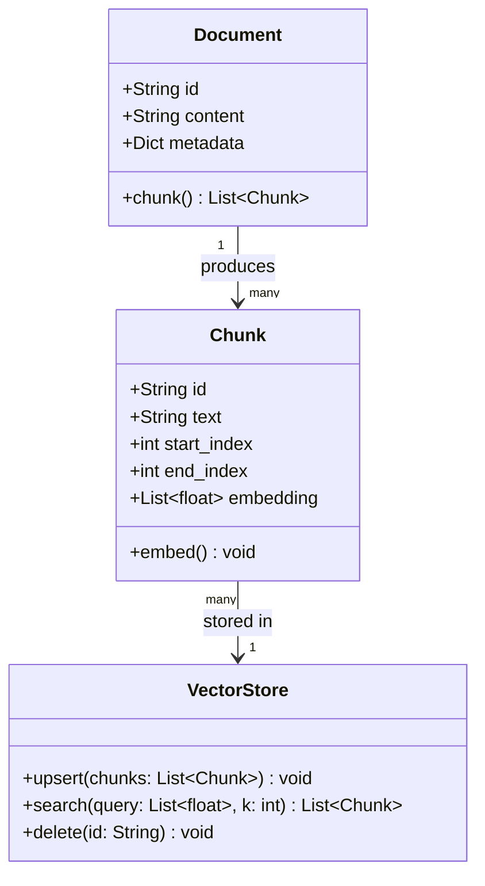
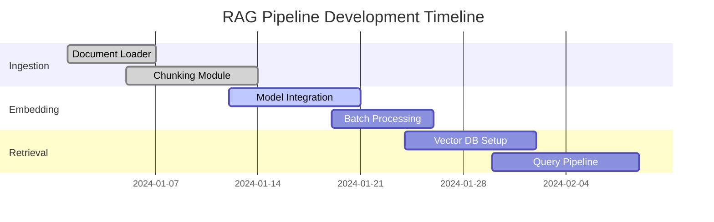
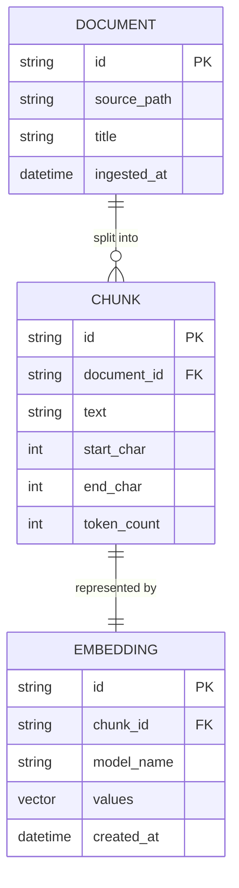

# Obsidian Markdown Feature Test File

> **Purpose:** This file is a comprehensive test document for validating a RAG ingestion pipeline. It covers every major Obsidian-supported Markdown feature, including standard CommonMark syntax, GitHub Flavored Markdown (GFM) extensions, and Obsidian-specific features.

**Tags:** #test #rag #pipeline #obsidian #markdown

---

## Table of Contents

- [[#Headings]]
- [[#Text Formatting]]
- [[#Lists]]
- [[#Links]]
- [[#Images]]
- [[#Blockquotes]]
- [[#Code]]
- [[#Tables]]
- [[#Task Lists]]
- [[#Footnotes]]
- [[#Callouts]]
- [[#Math (LaTeX)]]
- [[#Mermaid Diagrams]]
- [[#Obsidian-Specific Features]]
- [[#Embedded Content]]
- [[#Metadata (Frontmatter)]]
- [[#HTML Elements]]

---

## Headings

# Heading 1
## Heading 2
### Heading 3
#### Heading 4
##### Heading 5
###### Heading 6

Alternative Heading 1
=====================

Alternative Heading 2
---------------------

---

## Text Formatting

Plain paragraph text. Lorem ipsum dolor sit amet, consectetur adipiscing elit. Sed do eiusmod tempor incididunt ut labore et dolore magna aliqua.

**Bold text using double asterisks**
__Bold text using double underscores__

*Italic text using single asterisk*
_Italic text using single underscore_

***Bold and italic using triple asterisks***
___Bold and italic using triple underscores___

~~Strikethrough text~~

==Highlighted text== (Obsidian-specific)

`Inline code`

Superscript: X^2^ (Obsidian-specific)
Subscript: H~2~O (Obsidian-specific)

This is regular text with a line break  
(two trailing spaces before the newline above)

This is a new paragraph after a blank line.

---

## Lists

### Unordered Lists

- Item A
- Item B
  - Nested item B1
  - Nested item B2
    - Deeply nested item B2a
    - Deeply nested item B2b
- Item C

* Asterisk bullet
* Another asterisk bullet

+ Plus sign bullet
+ Another plus sign bullet

### Ordered Lists

1. First item
2. Second item
   1. Nested ordered item 2.1
   2. Nested ordered item 2.2
3. Third item

### Mixed Nested Lists

1. Ordered item one
   - Unordered child
   - Another unordered child
     1. Back to ordered
     2. Still ordered
2. Ordered item two

### Definition Lists (Obsidian supports via plugin / extended MD)

Term 1
: Definition for term 1.

Term 2
: First definition for term 2.
: Second definition for term 2.

---

## Links

### External Links

[OpenAI](https://www.openai.com)
[Anthropic](https://www.anthropic.com "Anthropic Homepage")

Bare URL: <https://www.example.com>
Email link: <test@example.com>

### Reference Links

[Reference link][ref1]
[Another reference][ref2]
[ref1]: https://www.example.com "Example Domain"
[ref2]: https://www.wikipedia.org

### Internal Obsidian Wiki Links

[[Some Note]]
[[Folder/Some Note]]
[[Some Note|Custom Display Text]]
[[Some Note#Section Heading]]
[[Some Note#Section Heading|Custom Alias for Heading]]

### Block References

[[Some Note#^block-id]]
[[Some Note#^block-id|Custom Alias]]

A paragraph that is a named block. ^named-block

---

## Images

### Standard Markdown Images


### Reference Images

![Alt text][img-ref]
[img-ref]: https://upload.wikimedia.org/wikipedia/commons/thumb/4/48/Markdown-mark.svg/208px-Markdown-mark.svg.png "Markdown Logo via Reference"

### Obsidian Image Embedding with Resize

![[some-local-image.png]]
![[some-local-image.png|400]]
![[some-local-image.png|200x150]]

---

## Blockquotes

> This is a simple blockquote.

> This is a multi-line blockquote.
> It continues on the next line.
>
> And this is a new paragraph within the blockquote.

> **Nested blockquotes:**
>
> > This is a nested blockquote inside a blockquote.
> >
> > > And this is triple-nested.

> ##### Blockquote with Heading
>
> A blockquote can also contain other Markdown elements like **bold**, *italic*, and `code`.
>
> - List item in a blockquote
> - Another list item

---

## Code

### Inline Code

Use `console.log()` to print output in JavaScript.
The `SELECT * FROM table` statement retrieves all rows.

### Fenced Code Blocks

```python
# Python example
def greet(name: str) -> str:
    """Return a greeting string."""
    return f"Hello, {name}!"

if __name__ == "__main__":
    print(greet("World"))
```

```javascript
// JavaScript example
const fetchData = async (url) => {
  try {
    const response = await fetch(url);
    const data = await response.json();
    return data;
  } catch (error) {
    console.error("Fetch failed:", error);
  }
};
```

```sql
-- SQL example
SELECT
    u.id,
    u.name,
    COUNT(o.id) AS order_count
FROM users u
LEFT JOIN orders o ON u.id = o.user_id
WHERE u.created_at >= '2024-01-01'
GROUP BY u.id, u.name
ORDER BY order_count DESC
LIMIT 10;
```

```bash
# Bash example
#!/usr/bin/env bash
set -euo pipefail

SOURCE_DIR="./input"
DEST_DIR="./output"

mkdir -p "$DEST_DIR"
for file in "$SOURCE_DIR"/*.md; do
    echo "Processing: $file"
    cp "$file" "$DEST_DIR/"
done
echo "Done."
```

```json
{
  "name": "rag-test",
  "version": "1.0.0",
  "features": ["chunking", "embedding", "retrieval"],
  "config": {
    "chunk_size": 512,
    "overlap": 64,
    "embedding_model": "text-embedding-3-small"
  }
}
```

### Indented Code Block (4 spaces)

    This is an indented code block.
    It is rendered as preformatted text.
    No syntax highlighting is applied.

---

## Tables

### Basic Table

| Column A | Column B | Column C |
|----------|----------|----------|
| Row 1A   | Row 1B   | Row 1C   |
| Row 2A   | Row 2B   | Row 2C   |
| Row 3A   | Row 3B   | Row 3C   |

### Aligned Table

| Left Aligned | Center Aligned | Right Aligned |
|:-------------|:--------------:|--------------:|
| Apple        | Banana         | Cherry        |
| 100          | 200            | 300           |
| true         | false          | null          |

### Table with Inline Formatting

| Feature          | Supported | Notes                          |
|------------------|:---------:|--------------------------------|
| **Bold**         | ✅        | Works in table cells           |
| *Italic*         | ✅        | Works in table cells           |
| `Inline code`    | ✅        | Works in table cells           |
| ~~Strikethrough~~| ✅        | Works in table cells           |
| Multi-line cell  | ❌        | Tables are single-line in GFM  |

### Wide Table (Pipeline Stress Test)

| ID  | Title                          | Category     | Priority | Status      | Assignee     | Due Date   | Tags                        |
|-----|--------------------------------|--------------|----------|-------------|--------------|------------|-----------------------------|
| 001 | Implement chunking strategy    | Engineering  | High     | In Progress | Alice Smith  | 2024-03-15 | #chunking #nlp              |
| 002 | Evaluate embedding models      | Research     | High     | Done        | Bob Jones    | 2024-02-28 | #embeddings #evaluation     |
| 003 | Set up vector database         | DevOps       | Medium   | Backlog     | Carol White  | 2024-04-01 | #vectordb #infrastructure   |
| 004 | Write ingestion tests          | QA           | Low      | In Progress | Dave Brown   | 2024-03-30 | #testing #pipeline          |

---

## Task Lists

- [x] Completed task
- [x] Another completed task
- [ ] Incomplete task
- [ ] Another incomplete task
  - [x] Completed sub-task
  - [ ] Incomplete sub-task
- [x] Task with **bold** description
- [ ] Task referencing a [[note link]]

---

## Footnotes

Here is a sentence with a footnote.[^1]

This sentence has multiple footnotes.[^2][^3]

Here is a sentence with a named footnote.[^named-note]

Long-form footnote example[^long]:

[^1]: This is the first footnote.
[^2]: This is the second footnote.
[^3]: This is the third footnote, referencing [a link](https://www.example.com).
[^named-note]: This footnote has a descriptive name instead of a number.
[^long]: This is a long-form footnote.

    It can contain multiple paragraphs.

    ```python
    # Even code blocks!
    print("Footnote with code")
    ```

---

## Callouts

Obsidian supports rich callout blocks (admonitions):

> [!NOTE]
> This is a note callout. Useful for supplementary information.

> [!TIP]
> This is a tip callout. Great for helpful hints and best practices.

> [!IMPORTANT]
> This is an important callout. Use for crucial information.

> [!WARNING]
> This is a warning callout. Alerts the reader to potential issues.

> [!DANGER]
> This is a danger callout. Reserved for critical risks or errors.

> [!INFO] Custom Title for Info
> This callout has a custom title overriding the default.

> [!SUCCESS]
> Operation completed successfully!

> [!QUESTION] Can callouts be nested?
> Yes, to a degree, depending on renderer support.

> [!ABSTRACT]
> Abstract or summary callout. Useful for TL;DR sections.

> [!EXAMPLE] Pipeline Test Case
> **Input:** A raw Markdown file with mixed features.
> **Expected Output:** Chunked, embedded, and indexed content in vector DB.

> [!QUOTE]
> "Any sufficiently advanced technology is indistinguishable from magic."
> — Arthur C. Clarke

> [!NOTE]- Collapsible Note (collapsed by default)
> This callout is collapsed by default in Obsidian. The `-` after the type collapses it.

> [!TIP]+ Collapsible Tip (expanded by default)
> This callout is explicitly expanded by default. The `+` after the type expands it.

---

## Math (LaTeX)

### Inline Math

The quadratic formula is $x = \frac{-b \pm \sqrt{b^2 - 4ac}}{2a}$.

Euler's identity: $e^{i\pi} + 1 = 0$.

The probability of event A given B: $P(A|B) = \frac{P(B|A) \cdot P(A)}{P(B)}$.

### Block Math

$$
\int_{-\infty}^{\infty} e^{-x^2} dx = \sqrt{\pi}
$$

$$
\mathbf{F} = m\mathbf{a}
$$

$$
\nabla \cdot \mathbf{E} = \frac{\rho}{\varepsilon_0}
$$

$$
\sum_{n=1}^{\infty} \frac{1}{n^2} = \frac{\pi^2}{6}
$$

### Matrix Math

$$
\begin{pmatrix}
a_{11} & a_{12} & a_{13} \\
a_{21} & a_{22} & a_{23} \\
a_{31} & a_{32} & a_{33}
\end{pmatrix}
\cdot
\begin{pmatrix} x_1 \\ x_2 \\ x_3 \end{pmatrix}
=
\begin{pmatrix} b_1 \\ b_2 \\ b_3 \end{pmatrix}
$$

---

## Mermaid Diagrams

### Flowchart



### Sequence Diagram



### Class Diagram



### Gantt Chart



### Entity Relationship Diagram



---

## Obsidian-Specific Features

### Tags

Inline tags: #obsidian #markdown #rag #test #pipeline #nlp #embeddings

Nested tags: #project/rag #project/rag/pipeline #status/in-progress

### Aliases (typically in frontmatter, shown here for reference)

Aliases allow a note to be found by multiple names:
```yaml
aliases:
  - "RAG Test"
  - "Markdown Sample"
  - "Feature Test File"
```

### Block IDs

Any block can be given a unique ID for direct referencing:

This is a referenceable paragraph. ^para-id-001

- List item that can be referenced ^list-item-id-001
- Another list item ^list-item-id-002

### Dataview Inline Fields (Obsidian Dataview Plugin)

Status:: In Progress
Priority:: High
Author:: Jane Doe
Created:: 2024-01-15
Due:: 2024-03-31
Rating:: 8/10

### Dataview Query Block (Dataview Plugin)

```dataview
TABLE file.name, Status, Priority, Due
FROM #test
WHERE Status != "Done"
SORT Priority DESC
```

### Templater Syntax (shown as code, not executed)

```
<% tp.date.now("YYYY-MM-DD") %>
<% tp.file.title %>
<% tp.user.name %>
```

---

## Embedded Content

### Embedded Note (full)

![[Another Note]]

### Embedded Note (specific section)

![[Another Note#Section Title]]

### Embedded Note with Alias

![[Another Note|Display Name]]

### Embedded Audio / Video / PDF (Obsidian supports)

![[sample-audio.mp3]]
![[sample-video.mp4]]
![[sample-document.pdf]]

---

## HTML Elements

Obsidian renders a subset of HTML within Markdown:

<details>
<summary>Click to expand this section</summary>

This content is hidden until the summary is clicked. Useful for collapsible sections in exported HTML or GitHub.

- Item inside details
- Another item
  
```python
# Code inside a details block
print("hidden code block")
```

</details>

<br>

<mark>Highlighted with HTML mark tag</mark>

<kbd>Ctrl</kbd> + <kbd>C</kbd> — keyboard shortcut notation

<sup>Superscript via HTML</sup> and <sub>Subscript via HTML</sub>

<div align="center">

**Centered content using HTML div**

</div>

<table>
  <tr>
    <th>HTML Table Header 1</th>
    <th>HTML Table Header 2</th>
  </tr>
  <tr>
    <td>HTML Cell 1</td>
    <td>HTML Cell 2</td>
  </tr>
</table>

---

## Horizontal Rules

Three or more hyphens:

---

Three or more asterisks:

***

Three or more underscores:

___

---

## Escaping Characters

The following special characters can be escaped with a backslash:

\* asterisk \_ underscore \` backtick \# hash \[ bracket \] bracket \( parenthesis \) parenthesis \! exclamation \\ backslash

---

## Unicode and Emoji

Unicode characters: α β γ δ ε ζ η θ λ μ π σ φ ψ ω Ω
Currency symbols: $ € £ ¥ ₹ ₿
Math symbols: ∑ ∫ ∂ ∇ ∞ ≈ ≠ ≤ ≥ ∈ ∉ ∩ ∪

Emoji (standard): 🚀 📄 🔍 🤖 💡 ✅ ❌ ⚠️ 📊 🗂️ 🔗 🧠

---

## Long-Form Prose (Chunking Stress Test)

This section contains dense long-form prose to stress-test chunking strategies, especially overlap handling and semantic boundary detection.

### Background

Retrieval-Augmented Generation (RAG) is a hybrid architecture that combines the parametric knowledge stored in a language model's weights with non-parametric knowledge retrieved dynamically from an external corpus. The core motivation is to overcome two fundamental limitations of pure generative models: knowledge staleness and hallucination. By grounding generation in retrieved evidence, RAG systems can produce responses that are both factually accurate and up-to-date, without requiring costly full model retraining.

### Ingestion Pipeline Overview

The ingestion pipeline is responsible for transforming raw source documents into a form that can be efficiently retrieved at query time. This process typically involves several sequential stages.

**Stage 1 – Loading:** Source documents arrive in heterogeneous formats: PDF, DOCX, HTML, plain text, and Markdown. Each format requires a dedicated loader capable of extracting clean text while preserving semantic structure such as headings, lists, and tables. Markdown loaders must be especially careful to correctly handle Obsidian-specific extensions such as wiki links, callouts, and embedded transclusions, which have no equivalent in standard CommonMark.

**Stage 2 – Cleaning:** Raw extracted text often contains artifacts: page numbers, headers and footers, repeated navigation elements, boilerplate legal text, and encoding errors. A cleaning stage normalises whitespace, removes non-semantic noise, and optionally performs language detection to route multilingual content appropriately.

**Stage 3 – Chunking:** Documents must be divided into chunks small enough to fit within an embedding model's context window (typically 256–8192 tokens) while preserving sufficient semantic context for each chunk to be independently meaningful. Common strategies include fixed-size chunking with overlap, recursive character text splitting, and semantically-aware splitting based on sentence boundaries or heading structure. The choice of strategy significantly impacts retrieval precision and recall.

**Stage 4 – Embedding:** Each chunk is encoded into a dense vector representation using an embedding model. The choice of model determines the dimensionality of the embedding space, the languages supported, and the trade-off between speed and retrieval quality. Popular options include OpenAI's `text-embedding-3-small` and `text-embedding-3-large`, Cohere's multilingual embeddings, and open-source alternatives such as `bge-m3` and `e5-mistral-7b-instruct`.

**Stage 5 – Indexing:** Embedded vectors are stored in a vector database alongside the original chunk text and associated metadata. Metadata typically includes the source document path, chunk index within the document, section heading, page number (for PDFs), and custom fields such as author, date, and category. Efficient approximate nearest-neighbour (ANN) indices such as HNSW or IVF-PQ enable sub-millisecond retrieval across millions of vectors.

### Edge Cases for Ingestion Testing

A robust ingestion pipeline must handle a variety of edge cases without failing silently:

1. **Empty documents** – Files with zero content or only whitespace should be skipped or logged, not passed downstream.
2. **Very short chunks** – Chunks below a minimum token threshold (e.g., fewer than 20 tokens) may carry too little signal and should be merged or discarded.
3. **Very long sections** – A single Markdown heading section may contain thousands of tokens. The chunker must split it without losing the heading context.
4. **Non-UTF-8 encoding** – Legacy documents encoded in ISO-8859-1 or Windows-1252 must be re-encoded cleanly.
5. **Nested transclusions** – Obsidian notes that embed other notes which themselves embed further notes can create recursive structures that must be detected and bounded.
6. **Code blocks** – Code blocks should ideally be kept intact or split only at logical boundaries (e.g., between functions), not mid-expression.
7. **Tables** – Tables broken across chunks lose their header row context. The pipeline should either keep tables intact or prepend the header row to each table chunk.
8. **Math blocks** – LaTeX expressions split across chunks become unparseable. Math blocks should be atomic.
9. **Mixed languages** – A document may switch between English and another language within a single section. Embedding models with limited multilingual support may produce poor representations for such chunks.
10. **Duplicate content** – Near-duplicate chunks (e.g., from boilerplate or repeated headings) bloat the index and reduce retrieval precision. Deduplication using MinHash or SimHash can mitigate this.

---

## Metadata (Frontmatter)

The following is an example of YAML frontmatter as Obsidian uses it (placed at the very top of a real Obsidian note):

```yaml
---
title: Obsidian Markdown Feature Test File
aliases:
  - RAG Test File
  - Markdown Sample
tags:
  - test
  - rag
  - pipeline
  - obsidian
  - markdown
author: Jane Doe
created: 2024-01-15
modified: 2024-03-10
status: In Progress
priority: High
category: Documentation
version: 1.0.0
source: https://help.obsidian.md
related:
  - "[[RAG Architecture]]"
  - "[[Vector Database Setup]]"
  - "[[Chunking Strategies]]"
custom_field_1: value_one
custom_field_2: 42
custom_field_3: true
---
```

> **Note for pipeline developers:** Frontmatter should be parsed separately from body content. YAML values should be extracted as structured metadata fields and stored alongside the chunk vectors in the database. Do not embed the raw YAML string as part of a text chunk.

---

## Summary

This document has covered the following Obsidian Markdown features:

| Category                     | Features Demonstrated |
|------------------------------|-----------------------|
| **Standard Markdown**        | Headings (H1–H6), paragraphs, bold, italic, strikethrough, inline code, horizontal rules, escaping |
| **Extended Markdown (GFM)**  | Tables, task lists, fenced code blocks with syntax highlighting, autolinks |
| **Obsidian-Specific**        | Wiki links, block IDs, transclusions, callouts, highlights, tags, aliases, Dataview fields |
| **Math**                     | Inline LaTeX, block LaTeX, matrices |
| **Diagrams**                 | Mermaid flowchart, sequence, class, Gantt, ER diagram |
| **Multimedia Embedding**     | Images (standard + Obsidian), audio, video, PDF |
| **HTML**                     | `<details>`, `<mark>`, `<kbd>`, `<sup>`, `<sub>`, `<div>`, `<table>` |
| **Metadata**                 | YAML frontmatter with tags, aliases, dates, custom fields |
| **Prose**                    | Long-form multi-paragraph text for chunking stress testing |
| **Edge Cases**               | Unicode, emoji, nested lists, nested blockquotes, footnotes |

*End of test file.*
